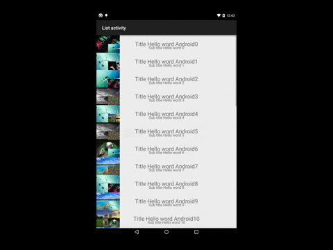
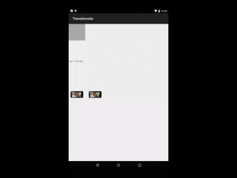

# TransitionGo 
If you need transits muttiple views beetven activities on pre lolipop devices you can use TransitionGo.


## Get start
Download [TransitionGo master](https://github.com/EnterPrayz/TransitionsGo/archive/master.zip) and add transitiongolib to your progect as module.
Add in first activity 

```
 findViewById(R.id.imageView).setOnClickListener(new View.OnClickListener() {
            @Override
            public void onClick(View v) {
                final Intent intent = new Intent(MainActivity.this, SubActivity.class);
                ActivityTransitionLauncher.with(MainActivity.this)
                        .transit("test1", v)
                        .transit("test2", findViewById(R.id.imageView2))
                        .transit("test3", findViewById(R.id.tv_text_test1))
                        .launch(intent);
            }
        });
```
